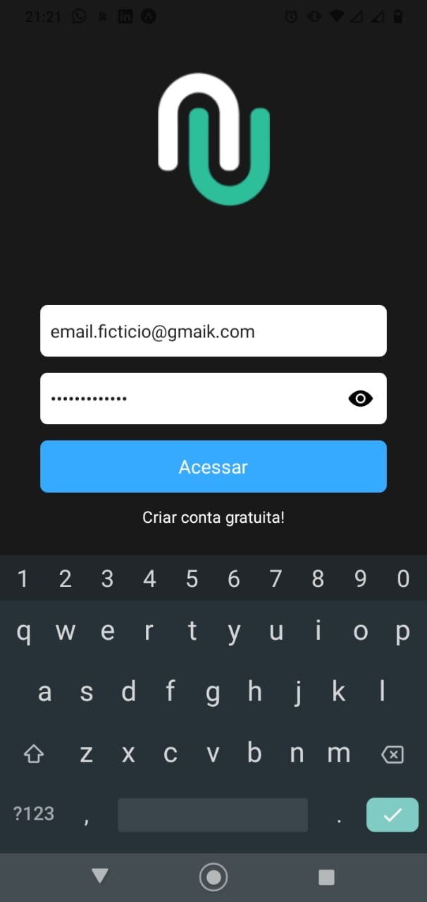
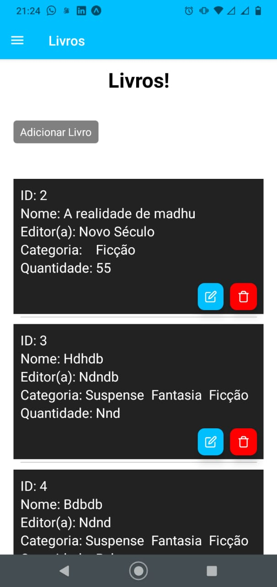
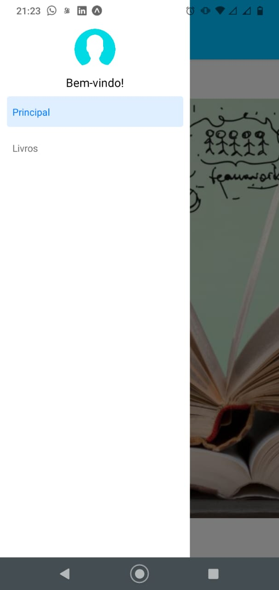
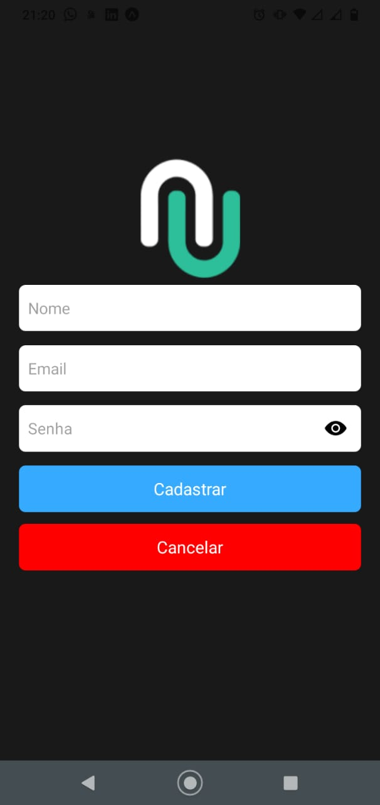
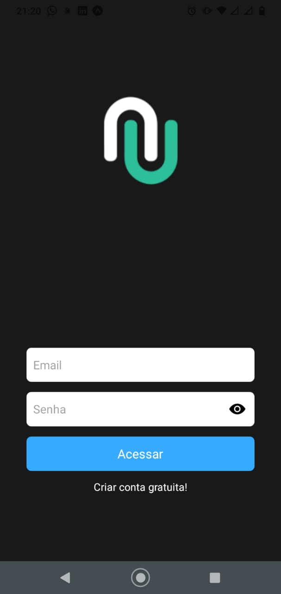
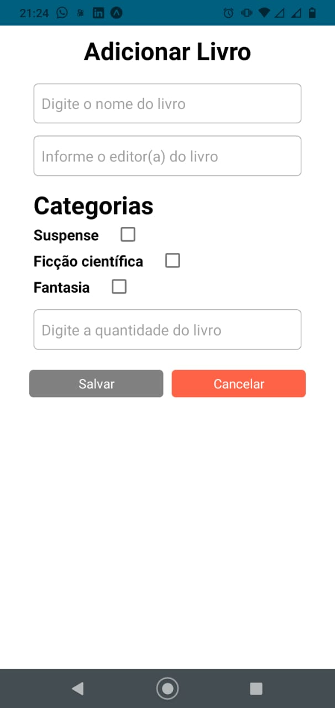

# Projeto_Mobile_av2 - React-native
Av2 de Computação Móvel/ API REST e CONTEXT

[

# Sobre o projeto

Uma aplicação CRUD em que permite criar cadastros de usuários .

## Layout da Aplicação
()()()()()()()

# Tecnologias utilizadas
## Back end
- Javascript, react native
## Front end
- react native / CSS 

# Como executar o projeto

Pré-requisitos: Fazer o git clone ou download do projeto, node, expo
<b>OBS: Startar o projeto usando expo</b>

# Autor

Matheus Pimentel Santos de Jesus

https://www.linkedin.com/in/matheus-pimentel-961253213

